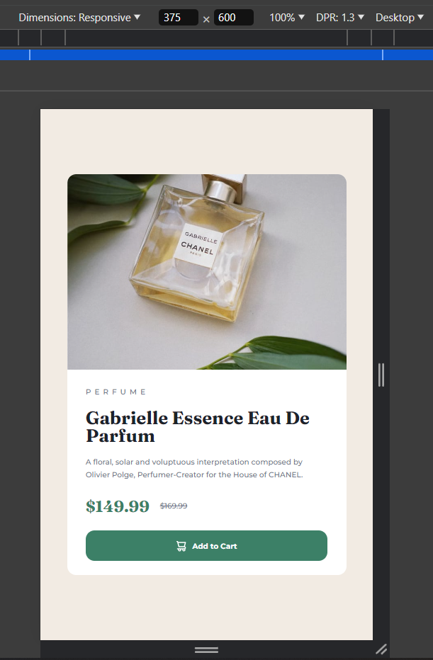

# Frontend Mentor - Product preview card component solution

This is my solution to the [Product preview card component challenge on Frontend Mentor](https://www.frontendmentor.io/challenges/product-preview-card-component-GO7UmttRfa). Frontend Mentor challenges help you improve your coding skills by building realistic projects.

## Table of contents

- [Overview](#overview)
  - [The challenge](#the-challenge)
  - [Screenshot](#screenshot)
  - [Links](#links)
- [My process](#my-process)
  - [Built with](#built-with)
  - [What I learned](#what-i-learned)

## Overview

The objective of this challenge is to desing a product preview card similar to the pictures given.

### The challenge

Users should be able to:

- View the optimal layout depending on their device's screen size
- See hover and focus states for interactive elements

### Screenshot

### Links

- Solution URL: [GitHub link](https://github.com/huz3y/product-preview-card-component-main.git)
- Live Site URL: [live site URL](https://product-preview-card-component-main-eosin.vercel.app)

## My process

### Built with

- Semantic HTML5 markup
- CSS custom properties
- Sass (SCSS)
- Flexbox
- CSS Grid
- Desktop-first workflow

### What I learned

Eventhough I have used art direction on images for tutorial projects. It's been sometime since I haven't really used responsive images like that.
